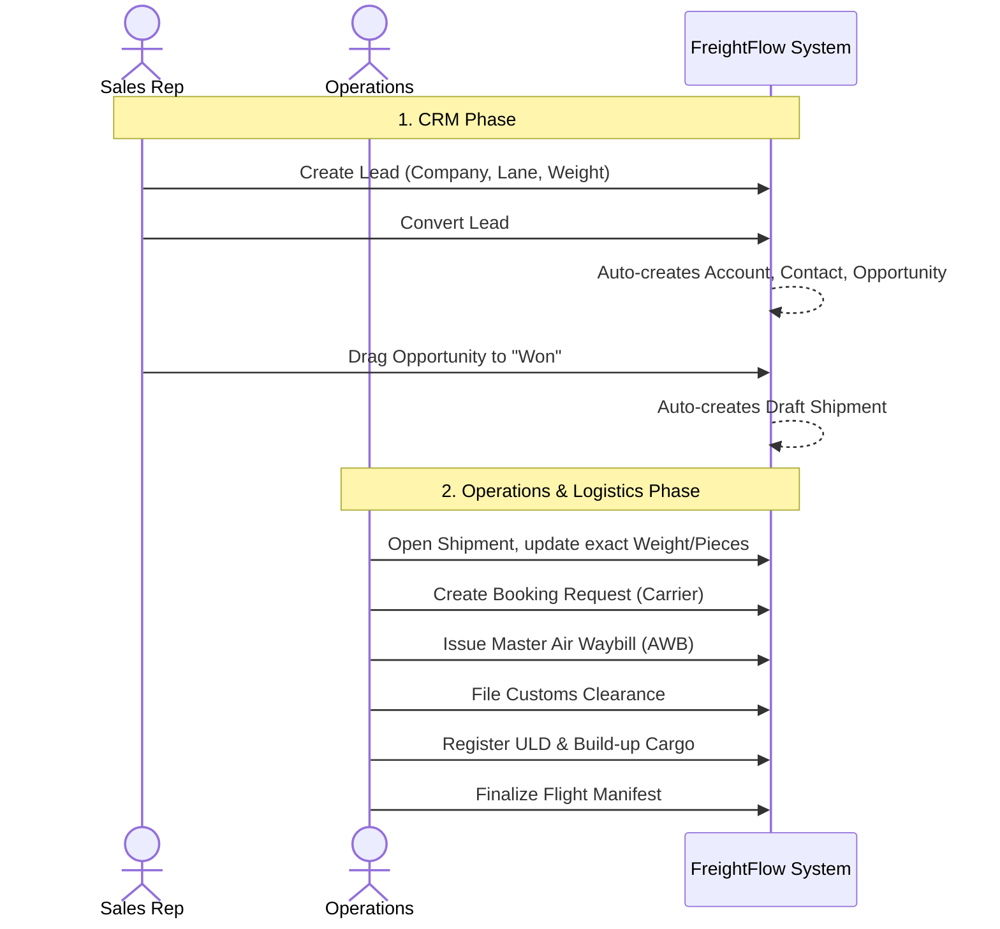

# FreightFlow: End-to-End Manual Workflow Guide

This guide explains how a user manually interacts with the system, taking a completely raw inquiry from a new customer all the way through the logistics pipeline to final delivery.

## 1. CRM & Lead Lifecycle

The process always begins in the CRM domain when a potential customer requests a freight quote.

1. **Create a Lead**: 
   - Navigate to **CRM > Leads**.
   - Click **New Lead**.
   - *Manual Input*: You enter the prospect's company name, contact info, origin-destination (trade lane), and a rough estimate of the cargo weight and value.
   
2. **Convert the Lead**:
   - Once qualified, you click the lead to view it and hit **Convert**.
   - *System Action*: In a single atomic database transaction, the system converts that Lead into three separate entities: an **Account** (the company), a **Contact** (the person), and an **Opportunity** (the potential deal).

3. **Win the Deal**:
   - Navigate to **CRM > Sales Pipeline**.
   - You negotiate the deal with the customer. Once they accept the quote, you drag the Opportunity card into the **"Won"** column.
   - *System Action*: Winning the deal fires an internal `DealWon` event. The system automatically takes the data from the Opportunity and creates an initial Draft **Shipment** in the Operations module.

## 2. Logistics & Air Freight Operations

Now that the deal is won, operations staff take over to physically move the freight.

1. **Manage the Shipment**:
   - Navigate to **Operations > Shipments**.
   - You will see the auto-generated shipment. You can click into it to flesh out the final details (actual pieces, final gross weight, special handling codes).

2. **Request Carrier Space (Booking)**:
   - Navigate to **Operations > Bookings**.
   - Click **New Booking Request**. 
   - *Manual Input*: You select the Shipment, choose a Carrier (e.g., Qatar Airways), and request a specific flight date and weight allocation.
   - Once the airline confirms, you update the Booking status to "Space Confirmed" and input the `Confirmed Flight Number` (e.g., QR8410).

3. **Issue the Air Waybill (AWB)**:
   - Navigate to **Operations > Air Waybills**.
   - Click **New Air Waybill**.
   - *Manual Input*: You issue the Master AWB (MAWB), linking it to the Shipment and the Carrier. If it's a consolidation, you can also issue multiple House AWBs (HAWB) and link them to this Master.

4. **File Customs Clearances**:
   - Navigate to **Operations > Customs**.
   - Click **New Clearance**.
   - *Manual Input*: You file the export/import declarations, inputting HS codes and duty amounts, and linking it to the Shipment.

5. **ULD Build-Up (Warehouse)**:
   - Navigate to **Operations > ULD Build-Up**.
   - Click **New ULD** to register an empty container.
   - *Manual Action*: Warehouse staff load the cargo into the ULD, updating its status to "Built-Up".

6. **Flight Manifest**:
   - Navigate to **Operations > Flight Manifests**.
   - Click **New Manifest**.
   - *Manual Input*: Before the flight departs, you create the final flight manifest (FFM) linking the Carrier, Route, and Date.

## Visual Flow Diagram

## How the Event System Bridges the Gap

Notice that Sales staff never have to manually type in a new Shipment, and Operations staff never have to re-type the customer's name or cargo type. 

Because we built the application with an **Event Bus** architecture, dropping an Opportunity into "Won" automatically broadcasts a message. The Operations side of the system listens for that message and builds the Shipment instantly, ensuring perfect data continuity and zero duplicate data entry.
